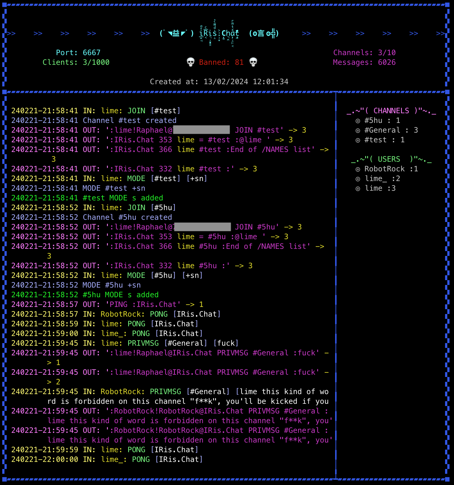

# IRis Chat

## IRC Server - Project 42
### Perfectly functionnal

All the commands that are necessary to have a good experience on a IRC chat network are working (A list of the availlable commands at the end of the file)
Accept connexions from any IRC client

### Bot protection
There is a bot protection, the server can ban IP adresses if some patterns are detected
Those adresses are stored in the conf file, with some other settings which can be changed.
The connections log file can also be used with Fail2Ban to block ddos

### Admin
The admin password is stored in the conf file as SHA256. 
If a client connects with this password, it becomes administrator of the server and have full access to any commands like a moderator, plus 'SERVBAN' and 'SERVUNBAN' followed by an IP which allows to manually ban or unban IPs.

## Execution
To compile :
> make

To run :
> ./irc_server {port} {server_password}

Can also be run using ./launch_serv.sh
This script starts the server and restart it if ever it crashes

### Logs
All messages are saved into a log file
All connections too, in a different file

## BOT
There is in the bot folder a program that can connects to the server, as a client, but as an admin
> ./irc_bot {ServerIP} {Port} {AdminPassword}

The bot with moderate the #General channel, watching for inappropriate or offensive words, insults.. and also spaming.
It will send warnings to the user, kick him of the channel after few warnings. It can also ban him for a period of time if he reiterates.

### Implemented commands :
"CAP", "PASS", "NICK", "USER", "PING", "PONG", "PRIVMSG", "WHO", "WHOIS",	"NAMES", "QUIT", "JOIN", "KICK", "INVITE", "TOPIC", "MODE", "PART", "SERVBAN", "USERHOST", "NOTICE", "SERVUNBAN", "LIST"

### A glimpse of the server at work

